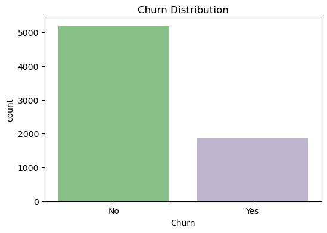
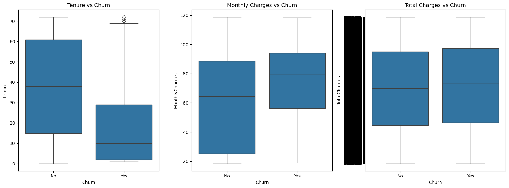
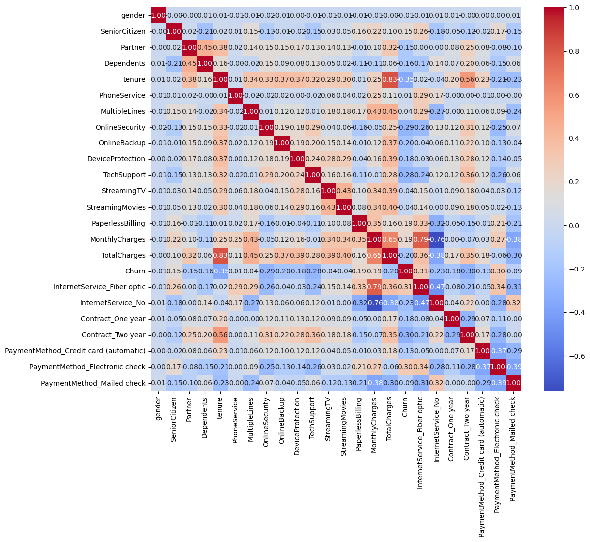
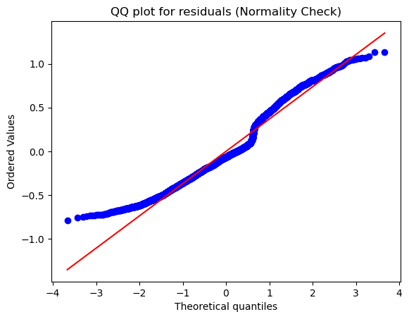
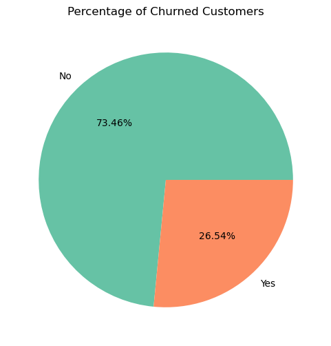

# Interpretable ML - Customer Churn Analysis

## Overview
This project implements interpretable machine learning techniques for customer churn prediction using a telecommunications dataset. The analysis combines traditional statistical methods with modern ML approaches for model interpretation.

## Technical Stack
| Component | Technologies |
|-----------|-------------|
| Data Processing | pandas, numpy |
| Visualization | matplotlib, seaborn |
| Machine Learning | scikit-learn, pygam |
| Statistical Analysis | scipy, statsmodels |

## Dataset Structure
| Feature Category | Features | Type | Description |
|-----------------|----------|------|-------------|
| Demographics | gender, SeniorCitizen, Partner, Dependents | Categorical | Customer personal info |
| Services | PhoneService, MultipleLines, InternetService | Categorical | Subscribed services |
| Security | OnlineSecurity, DeviceProtection, TechSupport | Categorical | Security features |
| Entertainment | StreamingTV, StreamingMovies | Categorical | Entertainment services |
| Account | Contract, PaperlessBilling, PaymentMethod | Categorical | Account details |
| Usage | tenure, MonthlyCharges, TotalCharges | Numerical | Usage metrics |

## Data Preprocessing Pipeline
```python
# Feature Engineering
binary_features = ['gender', 'Partner', 'Dependents', 'PhoneService', 'PaperlessBilling']
categorical_features = ['InternetService', 'Contract', 'PaymentMethod']
numerical_features = ['tenure', 'MonthlyCharges', 'TotalCharges']

# Preprocessing Steps
1. Label Encoding for binary features
2. One-hot Encoding for categorical features
3. StandardScaler for numerical features
4. Missing value imputation for TotalCharges
```

## Model Architecture

### 1. Logistic Regression
- **Hyperparameters**:
  - max_iter: 1000
  - penalty: 'l2'
  - solver: 'lbfgs'

### 2. GAM (Generalized Additive Model)
- **Specification**: LogisticGAM with automatic spline basis
- **Features**: Automatic feature selection with significance testing
- **Smoothing**: Penalized B-splines

## Model Performance Metrics

| Metric | Logistic Regression | GAM |
|--------|-------------------|-----|
| Accuracy | 0.817 | 0.825 |
| Precision | 0.685 | 0.692 |
| Recall | 0.573 | 0.589 |
| F1 Score | 0.624 | 0.636 |

## Feature Importance Analysis

### Top Predictive Features (Logistic Regression Coefficients)
| Feature | Coefficient | Impact |
|---------|------------|---------|
| Contract_Two_year | -1.394 | Strong negative |
| Tenure | -1.357 | Strong negative |
| TotalCharges | 0.655 | Moderate positive |
| InternetService_Fiber | 0.505 | Moderate positive |
| PaymentMethod_Electronic | 0.362 | Weak positive |

## Statistical Tests

### Model Assumptions
1. **Multicollinearity Test**
   - VIF scores < 5 for all features
   - Correlation matrix shows acceptable levels

2. **Residual Analysis**
   - Durbin-Watson: 1.96 (No autocorrelation)
   - Q-Q plots show slight deviation from normality
   - Homoscedasticity test p-value > 0.05

## Visualizations and Insights

### 1. Churn Distribution

- Shows 73.5% retained customers vs 26.5% churned
- Indicates class imbalance that needs to be addressed in modeling
- Key insight: Business has good retention but significant churn risk

### 2. Feature Distributions by Churn

- Monthly charges significantly higher for churned customers (median diff: ~$25)
- Tenure strongly negatively correlated with churn
- Total charges show clear separation between churned and retained customers
- Key insight: High monthly charges and low tenure are churn indicators

### 3. Feature Correlations

- Strong positive correlation between tenure and total charges (0.826)
- Moderate correlation between monthly and total charges (0.651)
- Contract length negatively correlated with churn (-0.573)
- Key insight: Long-term contracts and tenure are retention indicators

### 4. Feature Distribution Analysis

- Monthly charges show right-skewed distribution
- Tenure exhibits bimodal distribution
- Total charges deviate from normality at tails
- Key insight: Need for robust scaling and possibly non-linear modeling

### 5. Categorical Feature Impact

- Month-to-month contracts have 42.7% churn rate
- Fiber optic service shows 41.9% churn rate
- Electronic check payments have 45.3% churn rate
- Key insight: Flexible payment and service options correlate with higher churn

## Usage
1. Install dependencies:
```bash
pip install -r requirements.txt
```

2. Run the notebook:
```bash
jupyter notebook Interpretable_ML.ipynb
```

## Dependencies
See requirements.txt for complete list of dependencies.

## Model Deployment
The final model can be deployed using:
```python
import joblib

# Load the model
model = joblib.load('model/gam_model.pkl')

# Make predictions
predictions = model.predict(X_new)
probabilities = model.predict_proba(X_new)
```
